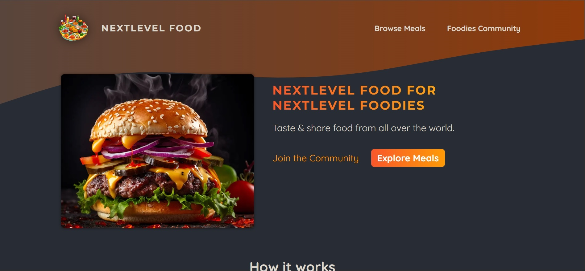

# :lock: NextLevel Food

This project aims to train all the basic features of NextJS using the 'APP' folder. These are client-side, server-side, routes, dynamic routes, error pages, not-found page, loadings, caching, actions and other hooks.

Esse projeto tem como objetivo treinar todas a funcionalidades basicas do NextJS usando a pasta 'APP'. Sendo elas client-side, server-side, routes, dynamic routes, error pages, not-found page, loadings, caching, actions e outros hooks.

## :computer: Features / Funcionalidades

- Client-side
- Server-side
- Routes
- Dynamic routes
- Error pages
- Not-found pages
- Loadings
- Caching
- Actions
- Hooks

## :hammer: Stack / Tecnologias utilizadas

- **HTML**
- **Javascript**
- **Next**
- **Sqlite**
- **CSS Modules**

**Link:** [https://next-level-food-ct0s.onrender.com/](https://next-level-food-ct0s.onrender.com/)

### :raising_hand: Autor

- **Website:**  [Alexander Peccin](https://portifolio-iota-bay.vercel.app/)
- **Linkedin:**  [Alexander Peccin](https://www.linkedin.com/in/alexander-peccin-616192106/)